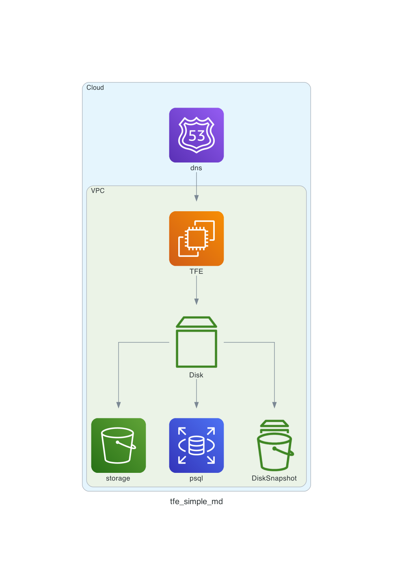
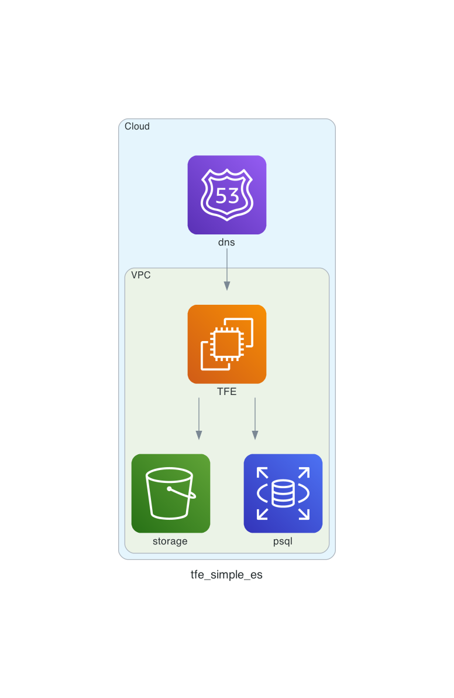
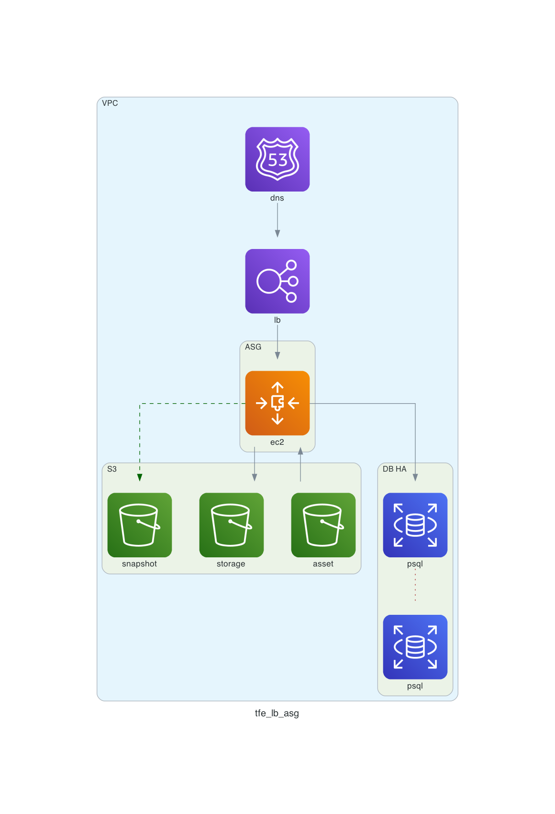
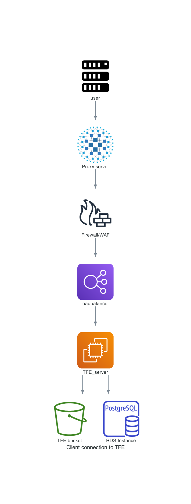
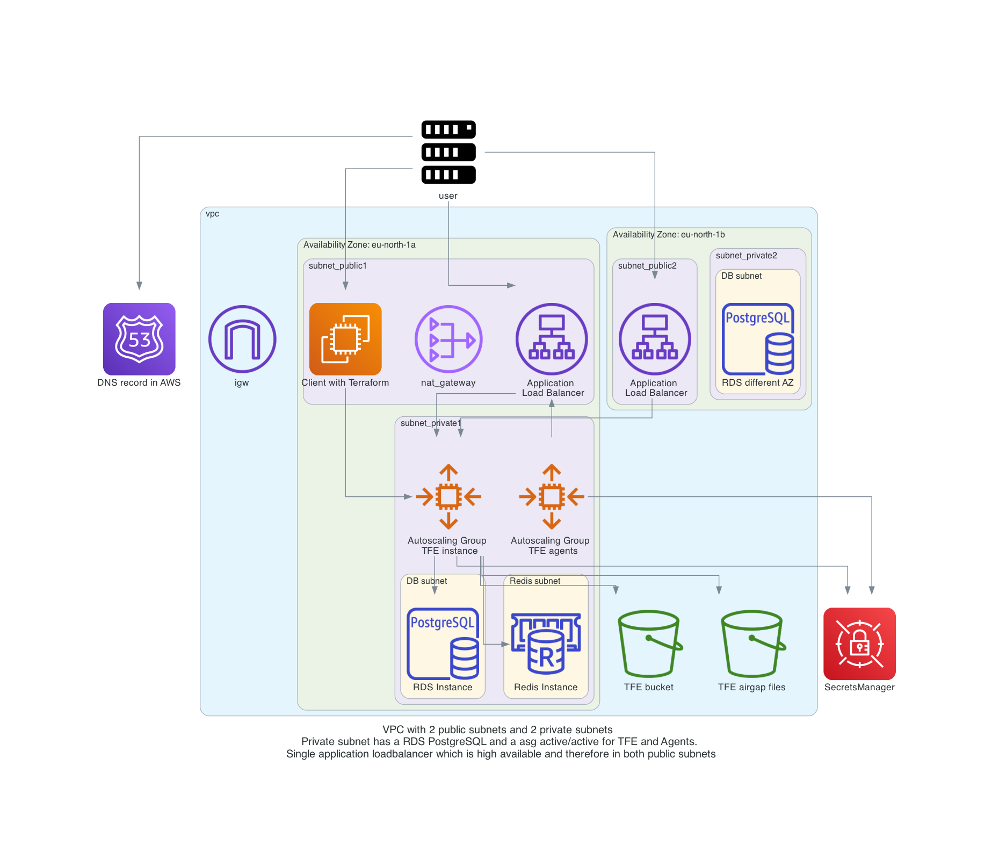

# TFE diagram templates

This repository contains diagrams for TFE environments that you can use or easily adjust to your needs. These templates are created using Diagrams. You can find more details here: https://diagrams.mingrammer.com/ 


# Prerequisites

# Python
Make sure you have python installed on your machine

https://www.python.org/

# install the diagrams

Details: https://diagrams.mingrammer.com/docs/getting-started/installation
```
pip install diagrams
```

# How to

- Clone the repository
```
git clone https://github.com/munnep/tfe_diagram_templates.git
```
- Go into the directory
```
cd tfe_diagram_templates/diagrams
```
- alter the diagrams and generate a new one
```
python3 tfe_lb_asg.py
```

# Example images

## TFE disk configuration 


## TFE external services configuration


## TFE autoscaling group simplified 


## TFE with WAF/proxy/load balancer


## TFE active/active with agents 
